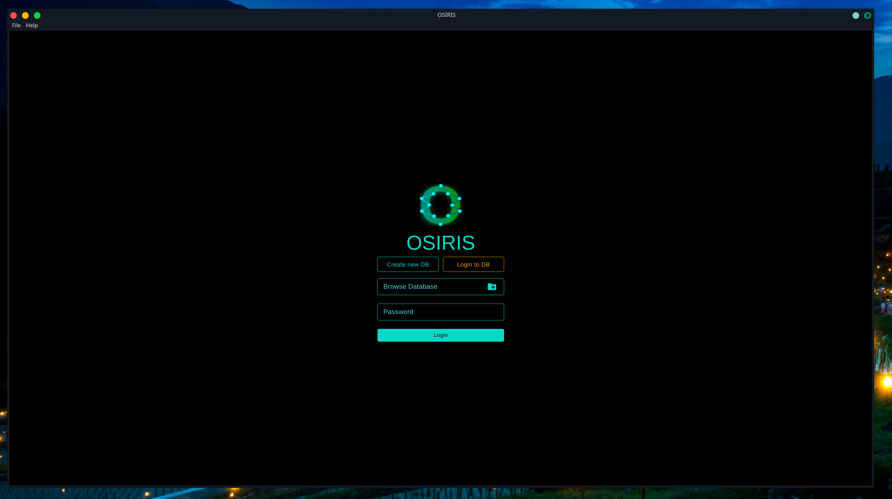
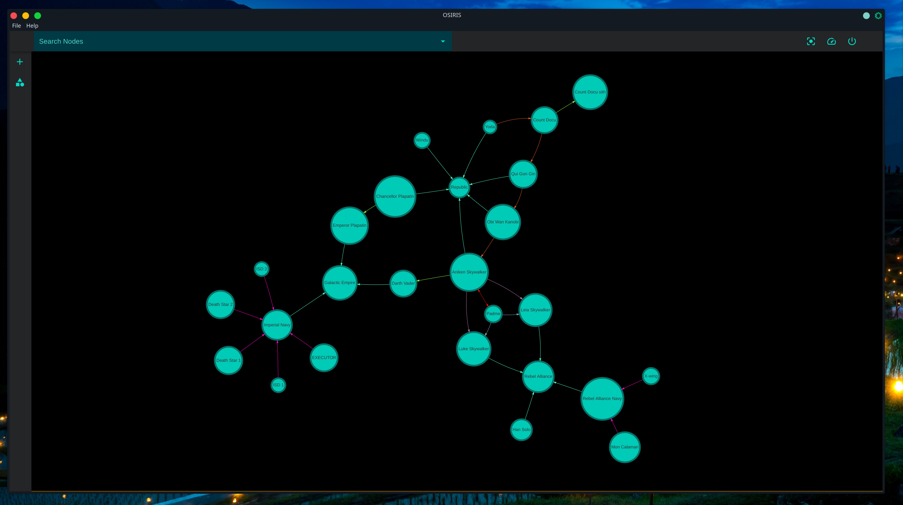
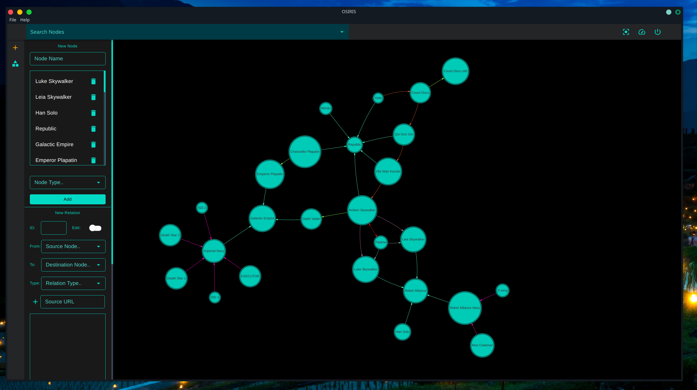
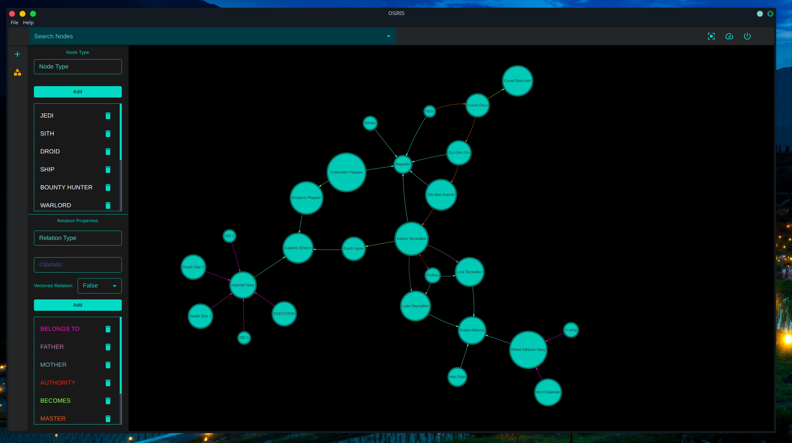

# OSIRIS:- Open Source Information Research and Intelligence System

OSIRIS is an open source free as in freedom app for storing and researching on events or relations.
Key feature:-
1. It stores node and relations and creates a graph out of it.
2. Database created by OSIRIS is encrypted using AES.

Login Screen

Graph

Add Panel

Properties Panel

# Building from source (Linux)

1. Open linux terminal 
   Installing curl
   sudo apt install curl

2. curl -sL https://deb.nodesource.com/setup_12.x | sudo -E bash -

3. Installing nodejs 
   sudo apt install nodejs

5. Install gcc
   sudo apt install build-essential

7. Installing crypto++ library.

   sudo apt install libcrypto++-dev libcrypto++-doc libcrypto++-utils 
   
8. create a folder in a place of your choosing and open a terminal in it.

9. Download the source code

   git clone https://github.com/YuvrajTalukdar/OSIRIS.git
   
10. go to OSIRIS/engineRelease in terminal and type 

    sudo npm link 
     
11. Now go back to OSIRIS directory in terminal and type 

    npm link AvyuktaEngine 
    
12. Install node-gyp

    sudo npm install -g node-gyp
    
13. now to install the js packages type

    npm install
    
    some errors regarding node gyp may appear here, just ignore them.
    
14. Now start the application by typing

    npm start
    
15. For building appImage type

    npm run build
    
    The app image will be saved in dist folder.
    
To build the engine from source type:-

HOME=~/.electron-gyp node-gyp rebuild -j 16 --target=12.0.0 --arch=x64 --dist-url=https://atom.io/download/electron

The compiled engine will be saved in build/Release.

There is a demo database in the source folder called star wars database, the password for it is test1234
